# ADA MicroMasters ML Research Methods

[](LICENSE)


[](https://github.com/basil-emeokoro/ADA-MicroMasters-ML-Research-Methods/actions/workflows/r-check.yml)

This repository is a professional research portfolio developed during the 12-week ADA Global Academy MicroMasters programme in Machine Learning and Research Methods. It documents reproducible statistical analysis, regression modelling, machine learning workflows, scientific reporting, and software engineering practice.

The repository is designed for professors, research supervisors, collaborators, recruiters, and technical reviewers who want to inspect both the analytical work and the engineering discipline behind it.

## Table of Contents

- [Portfolio Objectives](#portfolio-objectives)
- [Programme Timeline](#programme-timeline)
- [Machine Learning Workflow](#machine-learning-workflow)
- [Repository Structure](#repository-structure)
- [Documentation Index](#documentation-index)
- [Reproducibility](#reproducibility)
- [Technology Stack](#technology-stack)
- [Repository Policy](#repository-policy)
- [Citation](#citation)
- [License](#license)
- [Author](#author)

## Portfolio Objectives

- Build a coherent 12-week research portfolio across data science, statistical modelling, and machine learning.
- Preserve reproducible scripts, reports, figures, tables, and supporting outputs.
- Communicate findings in plain language while retaining statistical rigor.
- Demonstrate clean repository structure, version control discipline, and continuous integration.
- Avoid committing restricted datasets, private files, local notes, or development artefacts.

## Programme Timeline

| Week | Topic | Status | Main Output | Code | Report |
| --- | --- | --- | --- | --- | --- |
| Week 1 | Exploratory data analysis of Nigeria DHS child undernutrition | Complete | WAZ/WHZ EDA tables, figures, and PDF report | [R script](week01-eda/assignment/Sprint01_BasilEmeokoro.R) | [PDF](week01-eda/assignment/Sprint01_BasilEmeokoro.pdf) |
| Week 2 | Regression modelling: housing prices and diabetes readmission | Complete | Linear and logistic regression tables, figures, and PDF report | [R script](week02-regression-modelling/assignment/Sprint02_BasilEmeokoro.R) | [PDF](week02-regression-modelling/assignment/Sprint02_BasilEmeokoro.pdf) |
| Week 3 | To be added | Planned | TBD | TBD | TBD |
| Week 4 | To be added | Planned | TBD | TBD | TBD |
| Week 5 | To be added | Planned | TBD | TBD | TBD |
| Week 6 | To be added | Planned | TBD | TBD | TBD |
| Week 7 | To be added | Planned | TBD | TBD | TBD |
| Week 8 | To be added | Planned | TBD | TBD | TBD |
| Week 9 | To be added | Planned | TBD | TBD | TBD |
| Week 10 | To be added | Planned | TBD | TBD | TBD |
| Week 11 | To be added | Planned | TBD | TBD | TBD |
| Week 12 | To be added | Planned | TBD | TBD | TBD |

## Machine Learning Workflow

Each weekly assignment follows a reproducible workflow:

```mermaid
flowchart LR
    A[Problem Definition] --> B[Data Import]
    B --> C[Dataset Documentation]
    C --> D[Exploratory Analysis]
    D --> E[Data Preparation]
    E --> F[Model Development]
    F --> G[Interpretation]
    G --> H[Diagnostics and Evaluation]
    H --> I[Report Generation]
    I --> J[Portfolio Integration]
```



## Repository Structure

```text
.
|-- README.md
|-- BUILD.md
|-- CHANGELOG.md
|-- CITATIONS.md
|-- CITATION.cff
|-- LICENSE
|-- PROJECT_STATUS.md
|-- .github/
|   `-- workflows/
|       `-- r-check.yml
|-- docs/
|   `-- releases/
|-- week01-eda/
|   |-- assignment/
|   |-- resources/
|   `-- notes/
|-- week02-regression-modelling/
|   |-- assignment/
|   |-- resources/
|   `-- README.md
|-- week03/ ... week12/
`-- shared/
```

Each completed week contains the assignment script, report, figures, tables, outputs, documentation, and reproducibility guidance needed to review or rerun the work. Raw datasets are included only where redistribution is permitted.

## Documentation Index

| Document | Purpose |
| --- | --- |
| [BUILD.md](BUILD.md) | Clean-clone reproduction guidance and CI notes. |
| [CHANGELOG.md](CHANGELOG.md) | Chronological summary of weekly work and repository changes. |
| [PROJECT_STATUS.md](PROJECT_STATUS.md) | Dashboard for programme progress, repository health, CI, and milestones. |
| [CITATIONS.md](CITATIONS.md) | Catalogue of datasets, software, standards, and external resources. |
| [CITATION.cff](CITATION.cff) | GitHub citation metadata. |
| [LICENSE](LICENSE) | MIT License. |
| [docs/releases](docs/releases) | Release notes for completed milestones. |

## Reproducibility

The repository prioritizes deterministic and inspectable workflows:

- Scripts are designed to run from documented working directories.
- Assignment folders include recipient-facing README and BUILD guidance.
- Figures, tables, outputs, and PDF reports are generated by scripts.
- `sessionInfo()` is exported for completed R assignments.
- GitHub Actions validates assignment scripts using synthetic fixtures where raw data cannot be committed.
- Restricted, private, or unnecessarily large raw datasets are excluded from version control.

## Technology Stack

- R and base R graphics for statistical analysis, modelling, visualization, and report generation.
- GitHub Actions for continuous integration checks.
- Git and GitHub for version control, portfolio publication, and release management.
- PDF, CSV, PNG, and text outputs for reproducible reporting.
- Python and notebook-based tools may be introduced in later weeks where assignment requirements justify them.

## Repository Policy

This public repository contains polished assignment deliverables and portfolio engineering assets only.

Committed materials may include:

- assignment scripts and required notebooks;
- generated reports, figures, tables, and reproducibility outputs;
- README and BUILD files;
- changelog, project status, citation, license, and CI configuration.

Local-only materials must not be committed unless explicitly requested:

- prompts, AI conversations, and personal notes;
- planning documents and scratch files;
- experimental scripts and temporary datasets;
- `.Rhistory`, `.RData`, IDE settings, logs, duplicate folders, and local `Tasks` folders.

## Contribution Policy

This is a personal academic portfolio. External contributions are not expected. Suggestions, corrections, or review comments can be handled through issues or discussion with the author.

## Acknowledgements

This portfolio was developed during the ADA Global Academy MicroMasters programme in Machine Learning and Research Methods. Dataset providers and external resources are documented in [CITATIONS.md](CITATIONS.md).

## Citation

Citation metadata is available in [CITATION.cff](CITATION.cff). GitHub can use this file to display "Cite this repository".

## License

This repository is licensed under the [MIT License](LICENSE).

## Author

Basil Oforbuike Emeokoro

Psychometrician | Data Scientist | AI & Machine Learning Researcher | Software Developer

Email: basil.emeokoro@gmail.com
